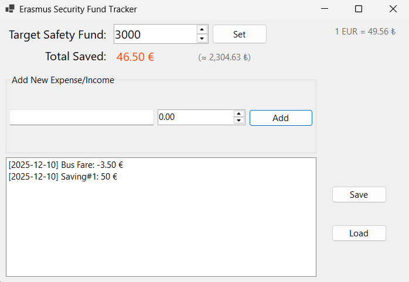

# 🌍 Erasmus Security Fund Tracker

A C# Windows Forms application designed to help students track their savings and calculate the financial gap for their Erasmus exchange program.

 
*(Buraya ekran görüntüsü koyacağız, aşağıda anlattım)*

## 🚀 Features

- **Goal Tracking:** Set a custom financial target (e.g., €3000) for your exchange program.
- **Custom Framework:** Uses a custom-built **SaveSystemFramework** for JSON-based data persistence.
- **Live Currency Conversion:** Integrates with **Frankfurter API** to display real-time EUR to TRY exchange rates.
- **Transaction History:** Add savings/incomes and view them in a reverse-chronological list.
- **Data Persistence:** Save and Load your progress locally using a modular backend system.

## 🛠️ Tech Stack

- **Language:** C# (.NET 6.0 / 8.0)
- **UI:** Windows Forms (WinForms)
- **Architecture:** OOP, Modular Design (Separation of Data & UI)
- **External Libraries:** System.Net.Http (REST API), Newtonsoft.Json (via Framework)

## 📦 How to Run

1. Clone the repository.
2. Open `ErasmusBudgetTracker.sln` in Visual Studio 2022.
3. Ensure `SaveSystemFramework` is properly referenced in the Solution Explorer.
4. Press **Start** to build and run.

## 👨‍💻 Author

**Hayri Cem Sivas** *Aspiring Software Engineer & Game Developer*